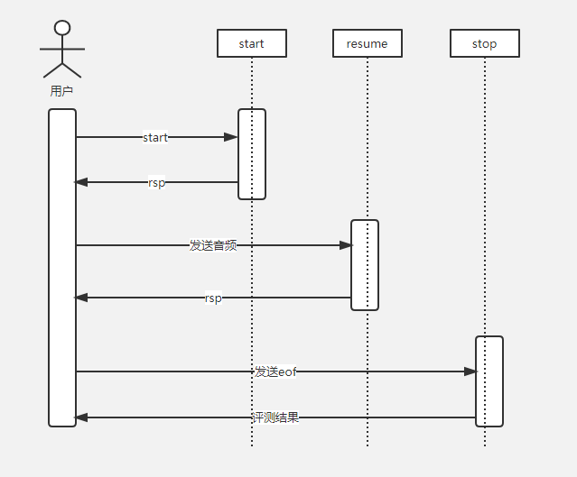

# 云知声 Websocket API文档

* [时序图](#sequence)
* [API](#API)
* [响应接口](#response)
* [错误码列表](#errorcode)


### <a name="sequence"></a>时序图
* 

### <a name="API"></a>API

#### 普通评测
``` json
{
  "mode": "word",
  "displayText": "hello world",
  "appkey": "联系商务同学获取",
  "scoreCoefficient": "1",
  "userID": "",
  "audioFormat": "opus",
  "eof": "gnh-test-end"
}
```
#### jsgf接口
```
{
  "mode": "qa",
  "Version": "1",
  "DisplayText": "Jsgf Grammar Tool Generated",
  "GrammarWeight": "{\"weight_struct\":[[{\"weight\":0.5,\"key\":\"good morning\"}]]}",
  "Grammar": "#JSGF V1.0 utf-8 cn;\ngrammar main;\npublic <main> = \"<s>\"(<a>|<a> to you)\"</s>\";\n<a> = (good morning);\n",
  "Appkey": "uus46rhwq3x75562p2cd7f7qplwso6wt5xd4qqae",
  "scoreCoefficient": "1",
  "UserID": "",
  "eof": "test-end",
  "audioFormat": "pcm"
}
```
#### 枚举接口
``` json
{
  "mode": "qa",
  "version": "1",
  "displayText": "Enumerate Grammar Tool Generated",
  "grammarWeight": "{\"weight_struct\":[[{\"weight\":0.5,\"key\":\"good morning\"}]]}",
  "grammar": "#enumerate \ngood morning\ngood morning to you\n",
  "appkey": "",
  "scoreCoefficient": "1",
  "userID": "",
  "eof": "test-end",
  "audioFormat": "pcm"
}
```
#### retell接口
``` json
{
  "mode": "retell",
  "Version": 1,
  "EvalType": "en.exam.retell",
  "DisplayText": "OralComposition Grammar Tool Generated",
  "Language": "en",
  "Grammar": "",
  "GrammarWeight": "",
  "Reference": {
    "ID": "",
    "answers": [
      {
        "type": 1,
        "text": "bookstore"
      },
      {
        "type": 1,
        "text": "she is going to bookstore"
      }
    ]
  },
  "Appkey": "",
  "scoreCoefficient": "1",
  "UserID": "",
  "eof": "test-end"
}

```
#### 评测请求接口字段说明(关键字不区别大小写)
* (可选值)      mode 可设置的内容值为word,sent,para,qa,retell，设置评测模式
* (普通评测必填) displayText 评测文本
* (必填)        appkey 访问凭证
* (可选值)      userID      用户信息
* (必填)        audioFormat 音频格式
* (必填)        eof 设置eof消息包内容，客户端需要该内容的唯一性，可选用uuid。
* (可选值)      scoreCoefficient 打分系数

### <a name="response"></a>响应接口
``` json
{
  "result": {},
  "area": "sh",
  "time": "1551409712576231666",
  "sid": "f4376e83-7ad0-4635-9812-bec949a2fa27",
  "errcode": 0,
  "errmsg": "ok"

}
```
#### 响应接口字段说明
* result 存放评测结果
* area 返回机房地区
* time 时间戳
* sid sessionID 理论上保证唯一性
* errcode 错误码
* errmsg  错误消息

### <a name="errorcode"></a> 错误码

>| 错误码（十进制） | 错误码（十六进制） | 错误码描述 | 原因 | 处理建议 |
>| :--- | :--- | :--- | :--- | :--- |
>| 57345 | 0x0000E001 | 连接引擎服务失败 | 服务连接数过大 | 建议提示网络出错 |
>| 57351 | 0x0000E007 | 传给引擎服务的用户文本过长 | 输入文本长度过大，最支持10000字符 | 减少文本长度 |
>| 57352 | 0x0000E008 | 半开放题型语法错误 | 半开放题型json语法错误 | 检查输入的半开放题型文本 |
>| 8193 | 0x00002001 | 连接n2t服务出错 | 服务偶尔连接失败 | 建议提示网络出错 |
>| 8195 | 0x00002003 | n2t解析错误 | 一般半开放题型可能会出现格式不正确解析失败 | 检查半开放题型语法 | 
>| 8198 | 0x00002006 | n2t组装结果出错,E模式会组装结果 | 服务组装出错 | 建议提示网络出错 |
>| 61440 | 0x0000F000 | 服务出错 | 后端服务内部未知错误 |  |  |
>| 61442| 0x0000F002 | 录音过程客户端取消评测 | 客户端断开评测 |  |
>| 61443| 0x0000F003 | 语音数据传送被中断 | 客户端或服务端网络出错 | 建议提示网络出错 |
>| 65295 | 0x0000FF0F | 参数错误 | 用户传过来的appkey为空 | 上传appkey |
>| 65527 | 0x0000FFF7 | 参数错误 | 用户传过来的文本是空，或者用户文本全部由特殊字符组成 | 检查文本 |
>| 65532 | 0x0000FFFC | 引擎服务stop返回错误 | 音频过短，少于64Byte;或是音频格式和访问地址不符合 | 检查音频和访问地址 | 
>| 65533 | 0x0000FFFD | 参数错误 | 用户传的appkey错误 |   | 建议联系云知声获取正确的appkey |
>| ？ | ？ | 参数错误 | 用户传的appkey过期 | 建议联系云知声获取appkey的有效期 |
>| ？ | ？ | 参数错误 | 音频时长超出范围 | 按照规定传入范围内的音频长度 |
>| ？ | ？ | 参数错误 | 不支持的音频格式 | 检查代码传入的音频格式参数 |
>| 49153 | 0x0000C001 | 服务错误 | 连接转码服务出错 | 网络等原因导致连接失败 | 建议提示网络出错 |
>| 49155 | 0x0000C003 | 服务错误 | 转码服务转码过程中出错 | 访问的服务地址和上传的音频格式可能不符 | 建议检查音频和访问地址 |
